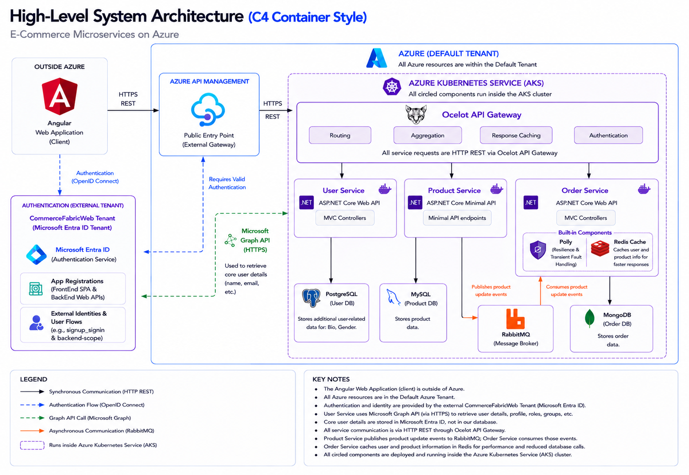
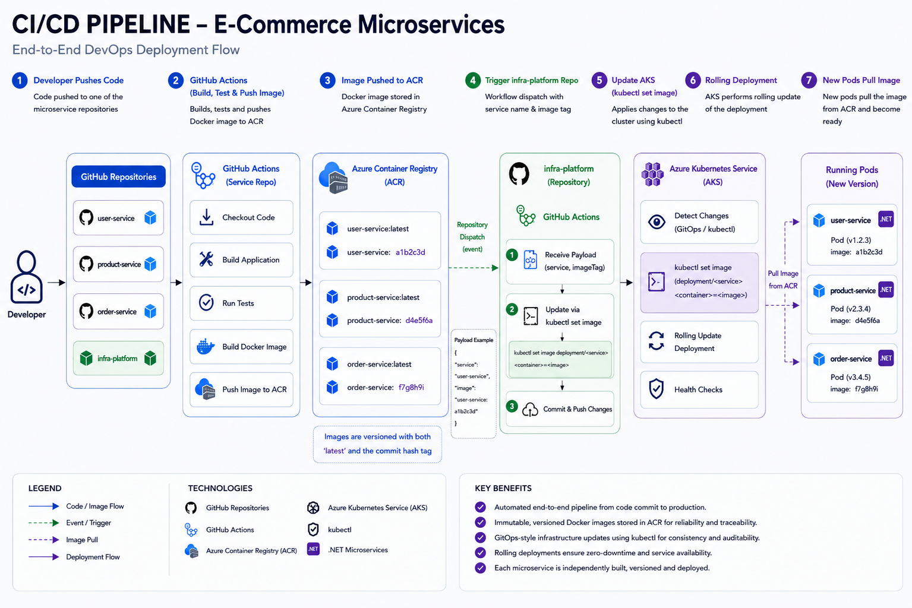

CommerceFabric is a portfolio project exploring distributed systems and microservice architecture using a production-inspired eCommerce domain. The goal is not just to build an online store, but to demonstrate architectural decision-making around service boundaries, data consistency, resilience, observability, and scalability.

---

## Microservices Overview

- TODO - put brief description of each service here and a link - then will have a readme in each with more details about the specific service, including its architecture, data model, and API endpoints.

---

## System Architecture Overview

This project is an Azure-hosted e-commerce platform built using a microservices architecture and deployed on Azure Kubernetes Service (AKS). Client requests originate from an Angular web application and are authenticated through a dedicated Microsoft Entra ID tenant before being routed through Azure API Management and the Ocelot API Gateway.

Within the AKS cluster, the platform consists of independently deployable User, Product, and Order services built with ASP.NET Core. Each service owns its own data store following the database-per-service pattern: PostgreSQL for user-related data, MySQL for product data, and MongoDB for order data. Services communicate synchronously through REST APIs and asynchronously through RabbitMQ for event-driven workflows.

Authentication and identity management are handled by a separate Microsoft Entra ID tenant, while the User Service integrates with Microsoft Graph to retrieve user profile information, roles, and group memberships. The Order Service leverages Redis caching to reduce repeated lookups of user and product information and uses Polly to provide resilience through retry and transient fault-handling policies when communicating with external services.

This architecture promotes scalability, fault isolation, independent deployment, and clear service ownership, while Azure API Management and Ocelot provide a centralized entry point for security, routing, and API governance.

### Key Technologies

- **Frontend:** Angular
- **API Gateway:** Azure API Management (External), Ocelot (Internal within AKS cluster)
- **Backend:** ASP.NET Core (.NET)
- **Container Orchestration:** Azure Kubernetes Service (AKS)
- **Authentication:** Microsoft Entra ID
- **Databases:** PostgreSQL, MySQL, MongoDB
- **Messaging:** RabbitMQ, Azure Service Bus
- **Caching:** Redis
- **Resilience:** Polly
- **Cloud Platform:** Microsoft Azure

---

## Azure Infrastructure Overview

- TODO - write this and make diagram

---

## CI/CD Overview

- The CI/CD pipeline automates the process of building, testing, and deploying individual microservices to Azure Kubernetes Service (AKS).

- When a developer pushes code to a service repository, GitHub Actions automatically builds the application, runs tests, creates a Docker image, and pushes the image to Azure Container Registry (ACR). Each image is tagged with both `latest` and the commit hash to provide traceability between deployments and source code versions.

- After the image is published, a workflow dispatch event triggers the infrastructure repository, which updates the Kubernetes deployment to use the newly generated image tag. AKS then performs a rolling deployment, gradually replacing existing pods with new versions while maintaining service availability.

- As the new pods start, they pull the updated image directly from ACR, pass health checks, and become active. This approach enables independent deployments for each microservice, zero-downtime releases, and a fully automated path from code commit to production.

---

## Important Note

CommerceFabric is designed around independently deployable microservices, with each service owning its data, business logic, and persistence strategy.

The platform intentionally uses a polyglot persistence approach, allowing services to choose the technologies that best fit their requirements, including Entity Framework Core, Dapper, relational databases, and document databases.

The architecture also explores common distributed systems patterns and challenges, including:

- Service autonomy and bounded contexts
- Event-driven communication with RabbitMQ
- Eventual consistency
- Redis caching
- Resilience and fault handling with Polly
- Authentication and identity management with Microsoft Entra ID

The goal of the project is to demonstrate practical cloud-native architecture patterns and the trade-offs involved in building and operating a microservices platform on Azure.