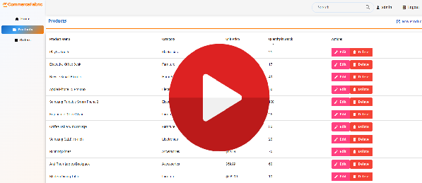
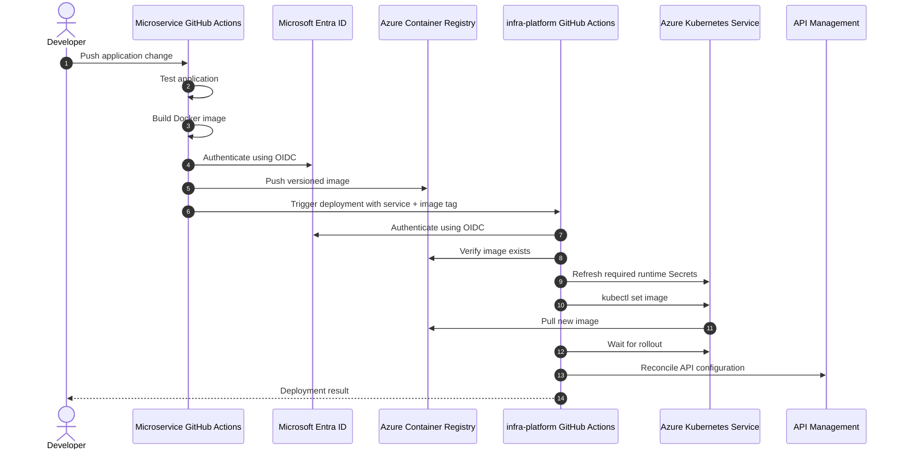

CommerceFabric is a portfolio project exploring distributed systems and microservice architecture using a production-inspired eCommerce domain. The goal is not just to build an online store, but to demonstrate architectural decision-making around service boundaries, data consistency, resilience, observability, and scalability.

## CommerceFabric Project Demo 📽️

**[View the CommerceFabric Project Demo Documentation](./docs/ProjectDemo.md)** for more screenshots, video demonstrations and other exciting stuff.

---

## Microservices Overview

- [Infra-Platform](https://github.com/CommerceFabric/infra-platform) - This repository contains the infrastructure-as-code (IaC) scripts and configuration files for deploying the CommerceFabric platform on Microsoft Azure. It includes `Bicep` scripts, `Kubernetes` manifests, and other resources needed to provision and manage the cloud infrastructure.
- [Service-Orders](https://github.com/CommerceFabric/service-orders) - This repository contains the Order Service, which manages order-related functionality such as order creation, order tracking, and order history. It integrates with the Product Service through RabbitMQ and Azure Service Bus to ensure product availability and consistency, and uses REST APIs to communicate with the User Service and Azure Entra ID respectively, to get user info.
- [Service-User](https://github.com/CommerceFabric/service-user) - This repository contains the User Service, which manages user-related functionality such as authentication, profile management, and role-based access control. It integrates with Microsoft Entra ID and Microsoft Graph to handle identity and user information.
- [Service-Products](https://github.com/CommerceFabric/service-products) - This repository contains the Product Service, which manages product-related functionality such as product catalog, inventory management, and pricing. It integrates with the Order Service to ensure product availability and consistency.
- [Web-Storefront](https://github.com/CommerceFabric/web-storefront) - This repository contains the Angular-based web storefront for the CommerceFabric platform, providing the user interface for browsing products, managing the shopping cart, and placing orders.

---

## System Architecture Overview

This project is an Azure-hosted e-commerce platform built using a microservices architecture and deployed on Azure Kubernetes Service (AKS). Client requests originate from an Angular web application and are authenticated through a dedicated Microsoft Entra ID tenant before being routed through Azure API Management and the Ocelot API Gateway.

Within the AKS cluster, the platform consists of independently deployable User, Product, and Order services built with ASP.NET Core. Each service owns its own data store following the database-per-service pattern: PostgreSQL for user-related data, MySQL for product data, and MongoDB for order data. Services communicate synchronously through REST APIs and asynchronously using both RabbitMQ and Azure Service Bus. 

When a new order is successfully created, the Order Service publishes an **Order Created event to an Azure Service Bus Topic**. The Product Service subscribes to this topic and processes the event asynchronously, reducing the stock levels of the products included in the order. A **Topic** was chosen rather than a simple queue to support a publish/subscribe model and make the architecture easier to extend. For example, future Payment and Notification services could independently subscribe to the same Order Created events, allowing a Payment Service to initiate payment processing and a Notification Service to send order confirmation notifications without introducing direct dependencies between these services and the Order Service. If the Product Service fails to lower its stock levels it moves the message to a **dead-letter queue** for later investigation, ensuring that the Order Service remains decoupled from the Product Service and can continue processing new orders without being blocked by failures in downstream services.

On Product Updation and Product Deletion, both RabbitMQ and Azure Service Bus are used to publish events that are consumed by the Order Service to update or delete its redis cache of product information. This ensures that the Order Service maintains an up-to-date view of product availability and pricing without introducing tight coupling between services. (Note: In a real-world implementation, you would typically choose either RabbitMQ or Azure Service Bus for asynchronous messaging, but both are included here to demonstrate experience with both self-hosted and Azure-managed messaging technologies.)

Authentication and identity management are handled by a separate Microsoft Entra ID tenant, while the User Service integrates with Microsoft Graph to retrieve user profile information, roles, and group memberships. The Order Service leverages Redis caching to reduce repeated lookups of user and product information and uses Polly to provide resilience through retry and transient fault-handling policies when communicating with external services.

This architecture promotes scalability, fault isolation, independent deployment, and clear service ownership. The combination of synchronous REST communication and asynchronous event-driven messaging also demonstrates how services can remain loosely coupled while supporting workflows that span multiple domains. Azure API Management and Ocelot provide centralized entry points for security, routing, and API governance, while Azure Service Bus Topics provide an extensible event-driven foundation for adding additional consumers as the platform evolves.

### Key Technologies

- **Frontend:** Angular
- **API Gateway:** Azure API Management (External), Ocelot (Internal within AKS cluster)
- **Backend:** ASP.NET Core (.NET)
- **Container Orchestration:** Azure Kubernetes Service (AKS)
- **Authentication:** Microsoft Entra ID
- **Databases:** PostgreSQL, MySQL, MongoDB
- **Messaging:** RabbitMQ, Azure Service Bus
- **Caching:** Redis
- **Resilience:** Polly
- **Cloud Platform:** Microsoft Azure
- **Containerization:** Docker, Kubernetes
- **Infrastructure as Code:** Bicep, Kubernetes manifests
- **CI/CD:** GitHub Actions (yml based pipelines for building, testing, containerizing, declaring infrastructure, uploading images to ACR, and deploying to AKS)

---

## CI/CD Overview

For more information, please see the [infra-platform repository](https://github.com/commercefabric/infra-platform):
- [Technical Overview](https://github.com/CommerceFabric/infra-platform/blob/main/docs/Technical.md)
- [Deployment Overview](https://github.com/CommerceFabric/infra-platform/blob/main/docs/DeploymentFlow.md)

### Microservice Release Sequence

---

## Important Note

CommerceFabric is designed around independently deployable microservices, with each service owning its data, business logic, and persistence strategy.

The platform intentionally uses a polyglot persistence approach, allowing services to choose the technologies that best fit their requirements, including Entity Framework Core, Dapper, relational databases, and document databases.

The architecture also explores common distributed systems patterns and challenges, including:

- Service autonomy and bounded contexts
- Event-driven communication with RabbitMQ
- Eventual consistency
- Redis caching
- Resilience and fault handling with Polly
- Authentication and identity management with Microsoft Entra ID

The goal of the project is to demonstrate practical cloud-native architecture patterns and the trade-offs involved in building and operating a microservices platform on Azure.

## Future Directions

- Add an Azure Front Door so it can be region balanced
- Add `[Authorize]` decorators to the required API methods so API methods themselves are protected (incase an attacker gains access to the internal ocelot api gateways IP) instead of relying on the auth being enforced on the external api gateway
- Switch from AKS to ACA as it simplifies the complexity + allows for scale down to 0 to reduce costs
- Add another AzureServiceBus topic for Order Success events, so after the product service attempts to reduce stock, it can publish an event to the Order Service to mark the order as successful (or failed), and then potentially add a new payment/ shipping micro-service which can also subscribe to this message.
- Potentially add an Azure Function to monitor the dead-letter queue and send an alert to, for example, Teams channel if messages are being sent there, so that the team can investigate and resolve issues quickly.
- At the moment database structure is seeded in deployment through `kubernetes configmap and job manifests'`. This could be better achieved through EF Core Migrations.
- Add an Observability stack (Prometheus, Grafana, Loki, Tempo) to monitor the health of the services and the AKS cluster.