# CommerceFabric — Project Demo

This page provides screenshots and video demonstrations of CommerceFabric running both in Microsoft Azure and in a local development environment.

For the architecture, technologies, CI/CD process, and individual microservice repositories, see the [main CommerceFabric README](README.md).

---

## Demo Videos

### Full Application Demo

[▶ Watch CommerceFabric Frontend Demo](https://youtu.be/e2fCbs92Rsk)

This demo shows the CommerceFabric Angular storefront communicating with the live Azure-hosted environment.

---

### Local Microservices Demo

[▶ Watch CommerceFabric Local Run Demo](https://youtu.be/TNarYDapEP0)

This demo shows the **Order Service running locally** together with the supporting CommerceFabric development environment through docker-compose, and the swagger screen for the service.

---

### API Authentication Demo

[▶ Watch CommerceFabric Postman Demo](https://youtu.be/Of2ZiNmfWOw)

This demo uses **Postman** to send a request to the CommerceFabric API and demonstrates the API's **Bearer token authentication requirement**.

---

# Application

## Microsoft Entra ID Authentication

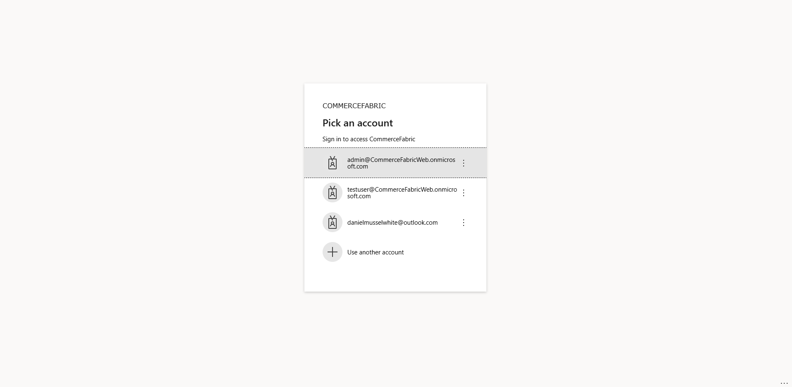

CommerceFabric uses **Microsoft Entra ID** for authentication. Users authenticate through the configured Entra ID tenant before accessing protected functionality within the application.

---

## Product Catalogue

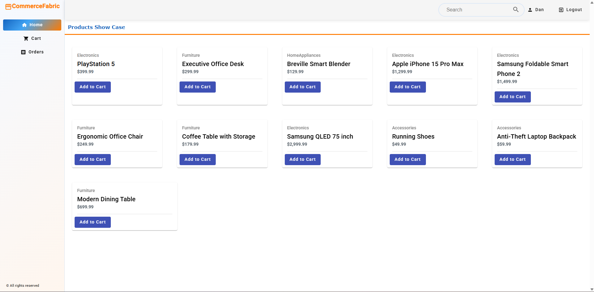

The Angular storefront provides the user-facing product catalogue, allowing authenticated users to browse products exposed by the CommerceFabric backend.

Product information is owned by the **Product Service** and retrieved through the platform's API infrastructure.

---

## Shopping Cart

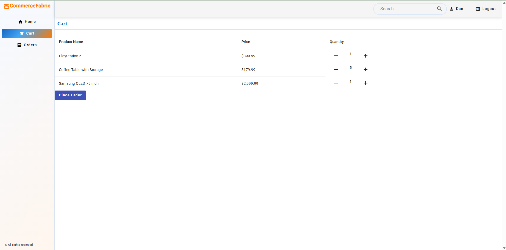

Users can add products to their shopping cart before placing an order.

The storefront provides the user-facing experience while the underlying CommerceFabric services handle the relevant product and order operations.

---

## User Orders

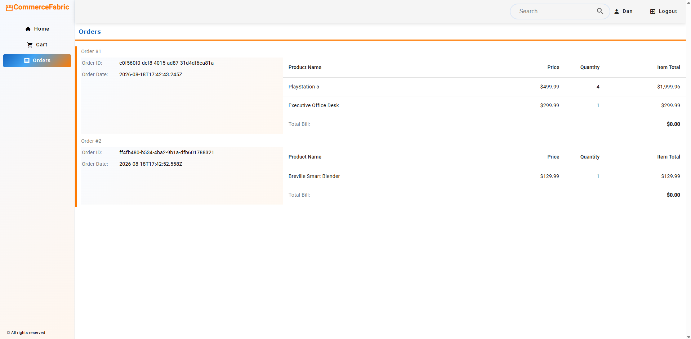

The orders page allows users to view their CommerceFabric orders and order information.

Order data is owned by the independently deployable **Order Service**, which maintains its own persistence and integrates with the other CommerceFabric services where required.

---

# Administration

## Order Management

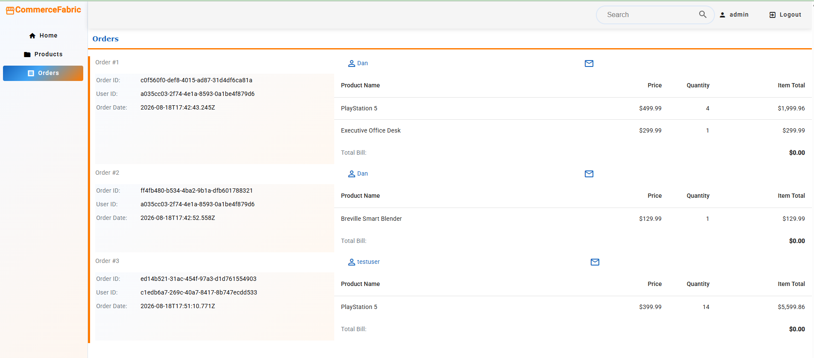

The administration interface provides a view of orders across the platform, demonstrating administrative functionality exposed through the Angular application.

---

## Product Management

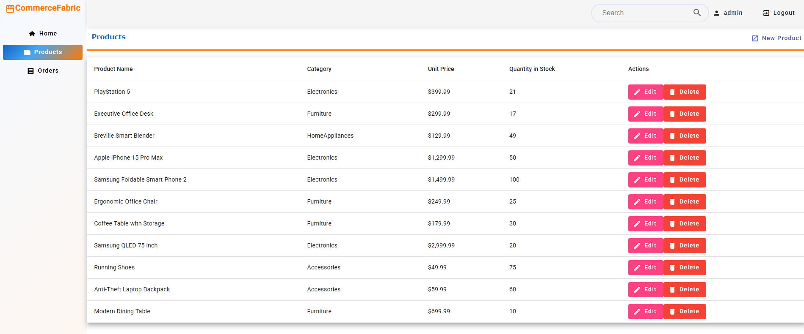

Administrators can update product information, delete products, or create new products through the storefront's administration interface.

Product changes are handled by the **Product Service**, which owns the product catalogue, inventory, and pricing domain.

---

# API Demonstrations

## Order Service — Swagger

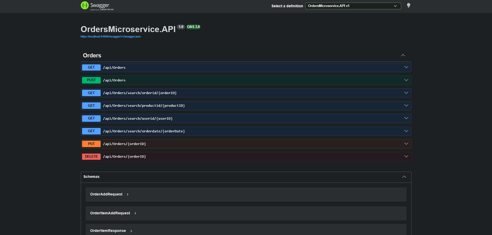

The Order Service exposes its API through **Swagger/OpenAPI**, providing an interactive interface for inspecting and testing its endpoints during development.

---

## Order Service — Postman

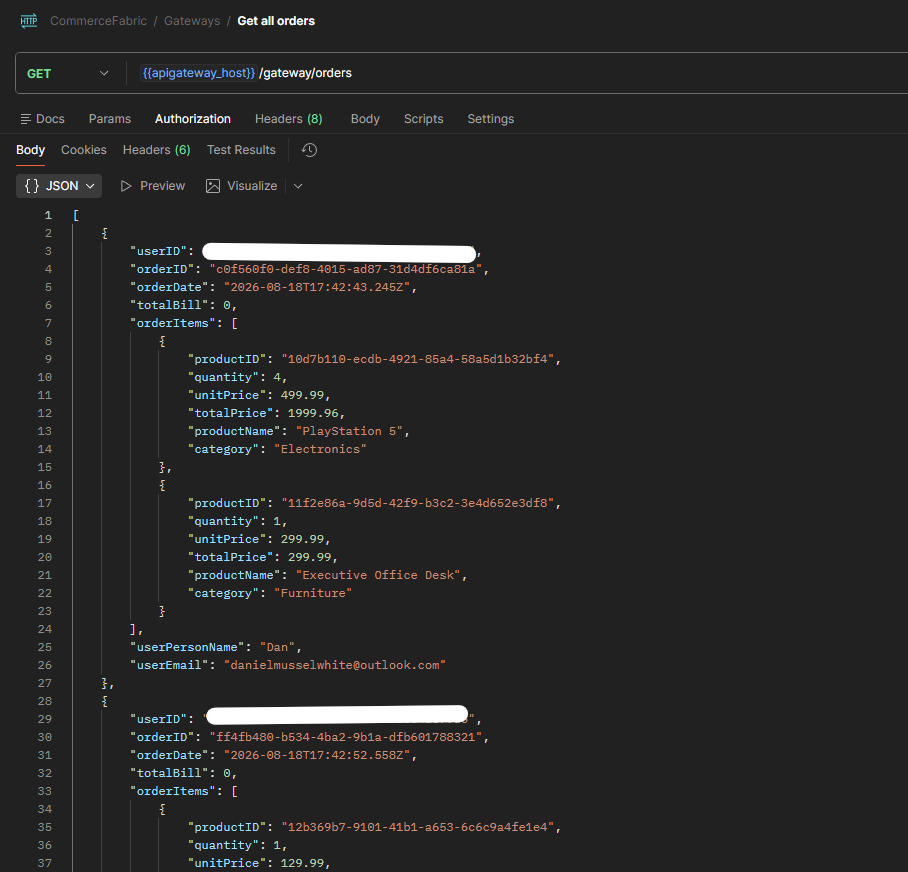

CommerceFabric APIs can also be called independently of the frontend using tools such as **Postman**.

This provides a convenient way to test API behaviour, authentication, request routing, and service responses directly.

See the [API Authentication Demo](../videos/CommerceFabric_PostmanDemo.mp4) for an example demonstrating the Bearer authentication requirement.

---

# Infrastructure

## Azure Resource Group

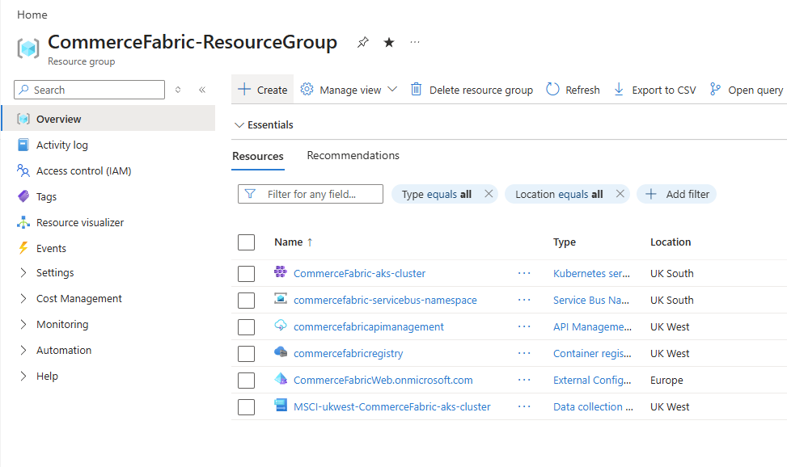

The CommerceFabric cloud environment is provisioned in **Microsoft Azure** using Infrastructure as Code.

The Azure environment contains the resources required to host and operate the platform, including AKS, container infrastructure, messaging, API management, and supporting cloud resources.

---

## Azure Kubernetes Service

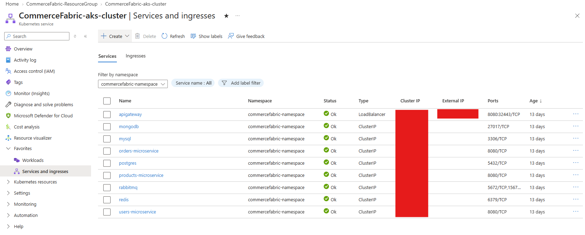

The CommerceFabric backend is deployed to **Azure Kubernetes Service (AKS)**.

The platform consists of independently deployable ASP.NET Core microservices, with Kubernetes providing container orchestration and deployment management within the Azure environment.

External API traffic is routed through **Azure API Management**, with **Ocelot** acting as the internal API gateway within the AKS cluster.

---

# Local Development Environment

## Docker Desktop

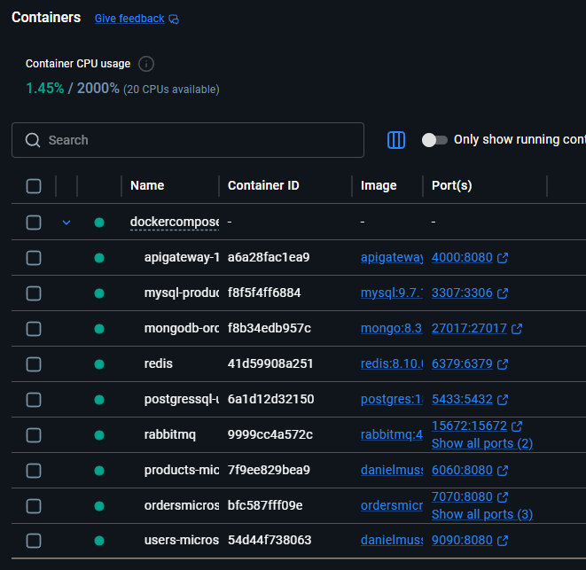

CommerceFabric can also be run locally using **Docker Compose**.

The local environment allows the microservices and supporting infrastructure — including components such as **Redis and RabbitMQ** — to be started together for development and integration testing without requiring the complete Azure environment.

See the [Local Microservices Demo](../videos/CommerceFabric_LocalRunDemo.mp4) for an example of starting the environment and sending a request to the locally running Order Service.

---

## Architecture & Technical Details

This page focuses on demonstrating the running application.

For a detailed explanation of the system architecture, microservices, messaging patterns, data stores, Azure infrastructure, and CI/CD process, see the **[CommerceFabric README](../README.md)**.

The individual repositories also contain service-specific implementation and deployment documentation.
